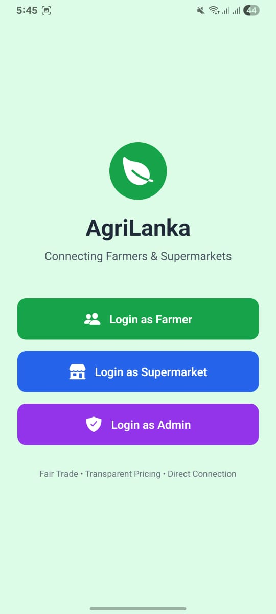
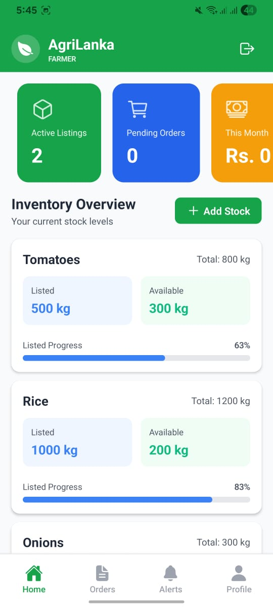
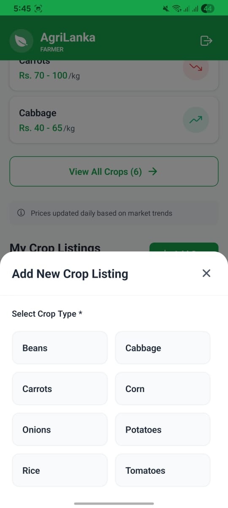
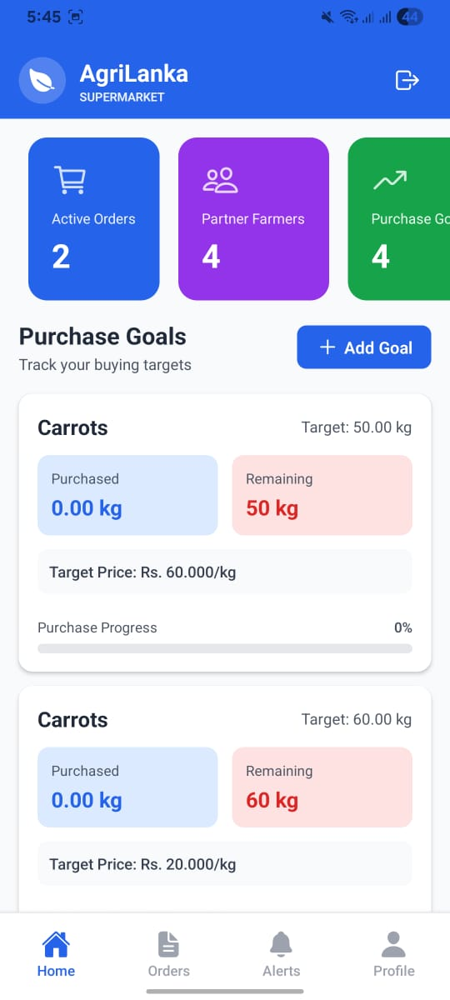
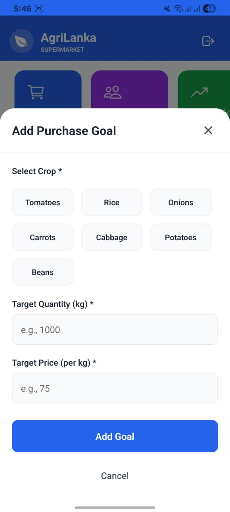
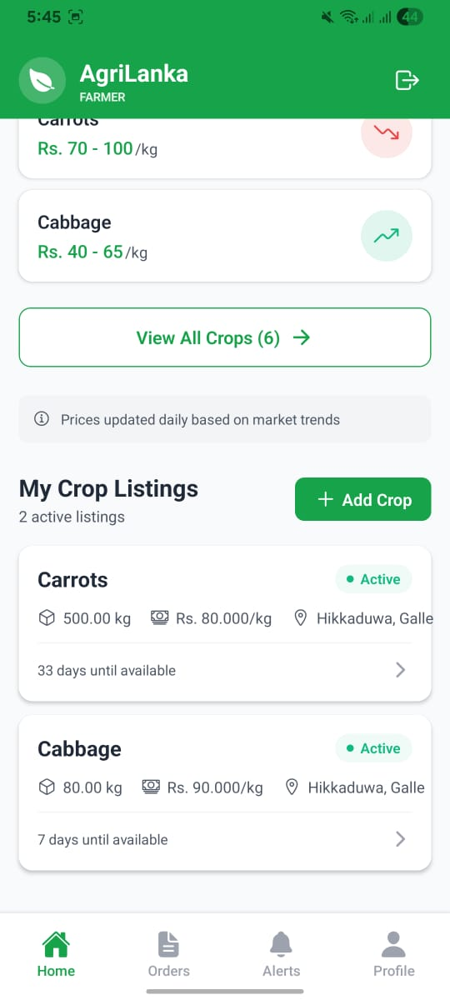

# AgriLanka 🌿
### Connecting Farmers & Supermarkets in Sri Lanka

A full-stack mobile application that bridges the gap between local farmers and supermarkets, enabling direct crop trading with transparent pricing.

---

## Screenshots

| Login                                 | Farmer Home                                       | Crop Listings                                         |
|---------------------------------------|---------------------------------------------------|-------------------------------------------------------|
|  |  |  |

| Supermarket Dashboard                                  | Purchase Goals                                 | Add Goal                                    |
|--------------------------------------------------------|------------------------------------------------|---------------------------------------------|
|  |  |  |

---

## Features

**Farmer Module**
- Register and manage farm profile
- Create and manage crop listings with pricing
- View real-time market price trends
- Track inventory and active listings
- Order management and notifications

**Supermarket Module**
- Browse available crops from local farmers
- Set and track purchase goals (saved to database)
- Place order requests directly to farmers
- View partner farmer profiles and ratings

**Admin Module**
- Dashboard with platform statistics
- User and listing management
- Reports and notifications

---

## Tech Stack

| Layer | Technology |
|-------|------------|
| Mobile Frontend | React Native (Expo) |
| Navigation | React Navigation (Stack + Bottom Tabs) |
| Backend API | Node.js + Express.js |
| Database | MySQL |
| Authentication | Firebase Auth |
| HTTP Client | Axios |
| Local Storage | AsyncStorage |

---

## Architecture

This app uses a **hybrid auth architecture**:
- **Firebase Authentication** handles user login/signup securely
- **MySQL** stores all application data (profiles, listings, orders, goals)
- Each MySQL user record is linked to Firebase via `firebase_uid`
- The Express.js backend exposes a REST API consumed by the mobile app

---

## Database Schema

Designed and implemented by the database architect. Key tables:

- `users` — core user records linked to Firebase UID
- `farmer_profiles` — extended farmer data with bank details
- `supermarket_profiles` — supermarket branch and contact info
- `crop_listings` — active crop listings with pricing
- `crops_types` — normalized crop type reference table
- `locations` — normalized Sri Lankan location data (province/district/city/area)
- `roles` / `roles_users` — role-based access control
- `storage` — farmer inventory tracking
- `purchase_goals` — supermarket buying targets

---

## Getting Started

### Prerequisites
- Node.js 18+
- MySQL 8+
- Expo Go app on your phone

### 1. Clone the repository
```bash
git clone https://github.com/senura-sandeepa/AgriLanka.git
cd AgriLanka
```

### 2. Set up the database
```bash
# Create database
mysql -u root -p -e "CREATE DATABASE agrilanka_db;"

# Import schema
mysql -u root -p agrilanka_db < db/schema.sql

# Import seed data (optional)
mysql -u root -p agrilanka_db < db/seed.sql
```

### 3. Configure backend
Update `backend/services/database/config.js` with your MySQL credentials:
```js
user: "your_mysql_username",
password: "your_mysql_password",
```

### 4. Configure environment variables
Create a `.env` file in the root folder:
```
EXPO_PUBLIC_FIREBASE_API_KEY=your_key
EXPO_PUBLIC_FIREBASE_AUTH_DOMAIN=your_domain
EXPO_PUBLIC_FIREBASE_PROJECT_ID=your_project_id
EXPO_PUBLIC_FIREBASE_STORAGE_BUCKET=your_bucket
EXPO_PUBLIC_FIREBASE_MESSAGING_SENDER_ID=your_sender_id
EXPO_PUBLIC_FIREBASE_APP_ID=your_app_id
```

### 5. Update API URL
In `src/config/apiConfig.js`, set your machine's local IP:
```js
export const API_BASE_URL = `http://YOUR_IP_ADDRESS:3000/api`;
```

### 6. Run the backend
```bash
cd backend
npm install
node server.js
```

### 7. Run the mobile app
```bash
# In the root folder
npm install
npx expo start
```
Scan the QR code with Expo Go on your phone.

---

## Project Structure

```
AgriLanka/
├── backend/
│   ├── services/          # Business logic services
│   │   ├── database/      # MySQL connection pool
│   │   ├── CropListingService.js
│   │   ├── FarmerProfileService.js
│   │   ├── signupService.js
│   │   └── locationService.js
│   └── server.js          # Express REST API
├── db/
│   ├── schema.sql         # Full database schema
│   └── seed.sql           # Sample data
├── src/
│   ├── screens/
│   │   ├── auth/          # Login, Signup screens
│   │   ├── farmer/        # Farmer module screens
│   │   ├── supermarket/   # Supermarket module screens
│   │   └── admin/         # Admin module screens
│   ├── services/          # API service functions
│   ├── navigation/        # React Navigation setup
│   ├── context/           # Auth context
│   └── utils/             # Colors, constants
└── assets/                # Images and icons
```

---

## API Endpoints

| Method | Endpoint | Description |
|--------|----------|-------------|
| POST | `/api/users` | Register new user |
| GET | `/api/farmer-profile/:userId` | Get farmer profile |
| PUT | `/api/farmer-profile/:userId` | Update farmer profile |
| GET | `/api/crop-types` | Get all crop types |
| POST | `/api/crop-listings` | Create crop listing |
| GET | `/api/crop-listings/farmer/:userId` | Get farmer's listings |
| PUT | `/api/crop-listings/:id` | Update crop listing |
| DELETE | `/api/crop-listings/:id` | Delete crop listing |
| GET | `/api/locations` | Get all locations |
| GET | `/api/purchase-goals/:userId` | Get supermarket goals |
| POST | `/api/purchase-goals` | Add purchase goal |

---

## License

This project is for educational purposes.